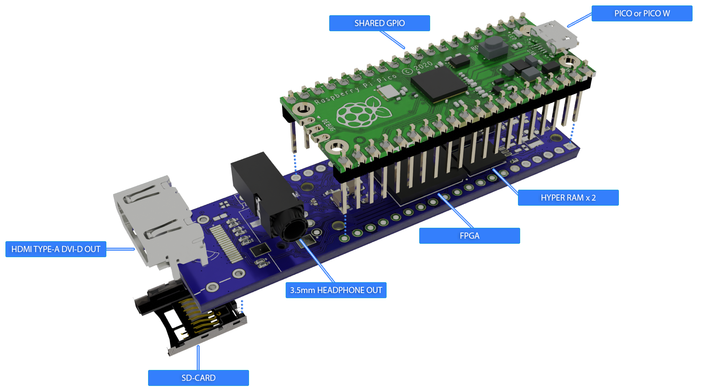
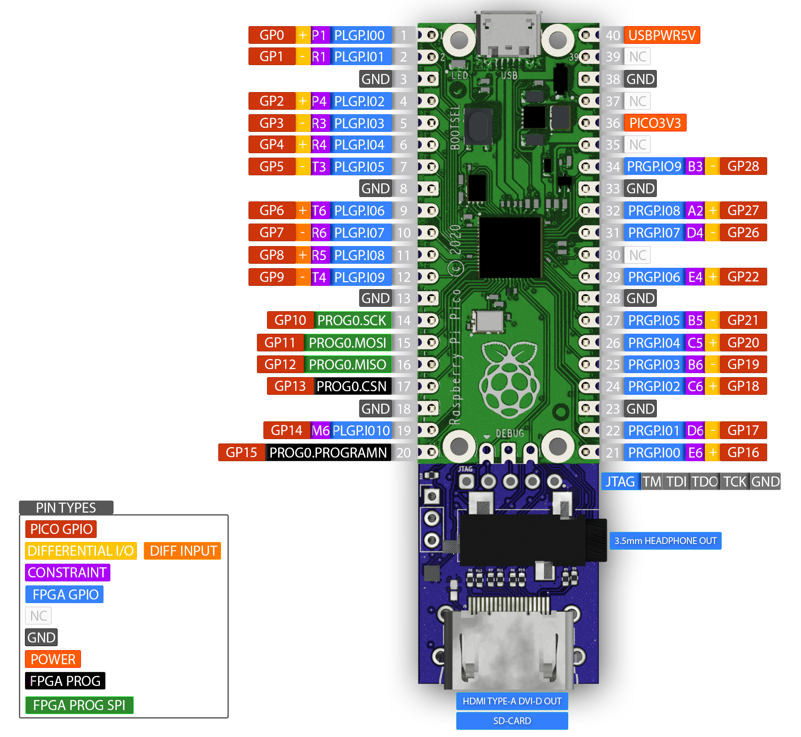
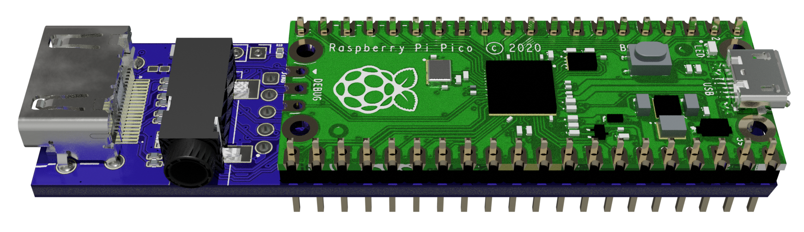
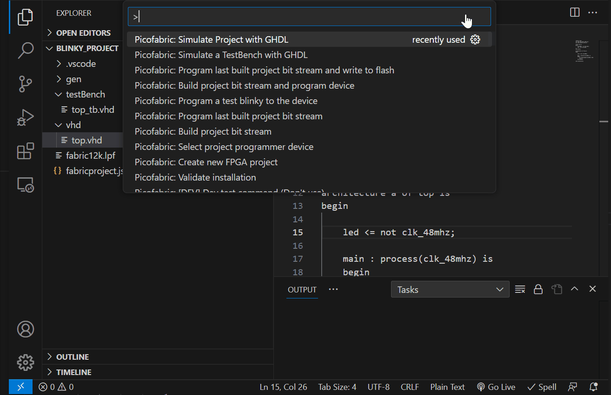

# PicoFabric Hardware :lemon: # 
[](https://github.com/picolemon/picofabric-ide)
[](https://github.com/picolemon/picofabric-hardware/blob/main/doc/datasheet.pdf)
[](https://github.com/picolemon/picofabric-hardware/blob/main/doc/sch.pdf)
[](http://picolemon.com/board/PICOFABRIC)
[](https://github.com/picolemon/picofabric-examples)
[](https://discord.gg/Be3yFCzyrp)



### Description :hammer:
PicoFabric is a small FPGA module for the Raspberry Pi Pico. The board comes with a Pico pre-soldered or headerless. The device can be plugged directly into a breadboard for rapid prototyping and comes with a Visual Stuidio Code IDE for Simulating, Building and programming on any platform. Integrates seamlessly with c/c++ or MicroPython for rapid development.

This repo contains the hardware design files and hardware references such as pinouts. Examples and links to software tools can be found below.

### Whats included :musical_note:
- [x] [Board schematic](doc/sch.pdf) reference.
- [x] [Pico Fabric IDE](https://github.com/picolemon/picofabric-ide) Visual Studio Code based simulator, builder & programmer.
- [x] [PicoFabric MicroPython](https://github.com/picolemon/picofabric-micropython) library.
- [x] [PicoFabric C/C++](https://github.com/picolemon/picofabric-c) library.
- [x] [VHDL, C & Python](https://github.com/picolemon/picofabric-examples) examples.
- [x] [Python CLI programmer](programmer/fabricSerialProgrammer/).

### Pinout :mag:
See the [datasheet](doc/datasheet.pdf) for a full pin listing.



### Board Assembly :mag:
The board is pre-assembled and preloaded with a USB serial bootloader for programming via the PicoFabric IDE. 


### Getting started - MicroPython :mag:
- Plug the device into a USB port, flash the Pico with a recent MicroPython UF2 image, if the Pico is pre-soldered then an image should be pre-installed.
- Install the [Pico Fabric IDE](https://github.com/picolemon/picofabric-ide)
- Run one of the provided MicroPython [example](https://github.com/picolemon/picofabric-examples) projects.

### Getting started - VHDL :mag:
- Install the [Pico Fabric IDE](picofabric-ide)
- ```(Ctrl + Shift + P) -> Run programmer boot loader install wizard``` To install the programmer UF2 image.
- Run one of the provided VHDL [example](https://github.com/picolemon/picofabric-examples) projects.

### Pico Fabric IDE :mag:
The [Pico Fabric IDE](https://github.com/picolemon/picofabric-ide) Visual Studio Code based extension is available which can be used as a simulator, builder & programmer.



## Programming

The PicoFabric IDE provides a built in programmer for the PicoFabric development board. A UF2 bootloader image is deployed to the RP2040 device to provide bit stream programming and flash storage.

- UF2 Bootloader images for Pico programmer device.
- USB bitstream programmer.
- Run a precompiled test blinky on the device to verify basic functionality.
- program.py CLI programmer is provided in the extension resources directory or can be downloaded from [here](https://github.com/picolemon/picofabric-hardware/tree/main/programmer/fabricSerialProgrammer).

The [MicroPython library](https://github.com/picolemon/picofabric-micropython) and [C/C++ library](https://github.com/picolemon/picofabric-c) provides a programmer for integration. This allows programming the device from code eg. the [Micro Python examples](https://github.com/picolemon/picofabric-examples/tree/main/micropython) uses this feature to upload a bitstream before interacting with the FPGA.

#### Programming commands ####

```
(Ctrl + Shift + P) -> Build project bit stream and program device
```
Build and program the device in one go.
<br /><br />


### Support :zap:
- Drop by the [discord](https://discord.gg/Be3yFCzyrp)
- Email help@picolemon.com

Copyright (c) 2023 picoLemon
